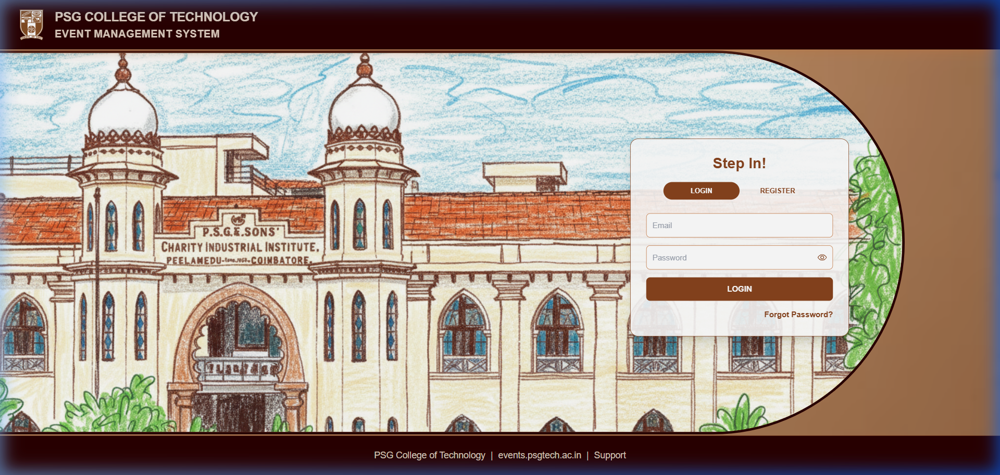

<div align="center">
  

  <p align="center">
    <strong>A modern, full-stack event management portal built for PSG College of Technology.</strong><br>
    Automate approvals, track resources, and manage campus events seamlessly.
  </p>

  <p align="center">
    <a href="https://react.dev"></a>
    <a href="https://expressjs.com/"></a>
    <a href="https://nodejs.org/"></a>
    <a href="https://www.postgresql.org/"></a>
    <a href="https://redis.io/"></a>
    <a href="https://tailwindcss.com/"></a>
  </p>
</div>

---

## 🚀 Features

- 🔐 **Secure Authentication** — JWT-based auth with OTP email verification (Nodemailer) and bcrypt password hashing.
- 📅 **Event Proposal System** — Students and faculty can propose events with dates, venues, sponsors, and budgets.
- 📋 **Admin Approval Workflow** — Multi-tier approval system for department heads and administrators.
- 🏢 **Resource Management** — Track booked halls, multimedia requirements, and campus facilities.
- 🖼️ **Cloud Uploads** — Built-in Cloudinary integration for event banners and approval documents.
- 🐳 **Dockerized** — Fully containerized for easy deployment and scaling.

---

## 🎨 Beautiful User Interface

Designed with a premium "heritage" aesthetic honoring the rich history of PSG College of Technology, featuring smooth transitions (`framer-motion`), fully responsive layouts, and intuitive dashboards.

<div align="center">
  
</div>

---

## 🛠️ Tech Stack

### Frontend
- **Framework:** React + Vite
- **Styling:** Tailwind CSS
- **Animations:** Framer Motion
- **Icons:** Lucide React & React Icons
- **Routing:** React Router DOM
- **HTTP Client:** Axios

### Backend
- **Runtime:** Node.js
- **Framework:** Express.js
- **Database:** PostgreSQL (with `pg` array logic for JSON flexible schemas)
- **Caching:** Redis
- **Security:** bcrypt, JWT, Express Rate Limiter
- **File Storage:** Cloudinary & Multer
- **Emails:** Nodemailer & Handlebars templates
- **PDF Generation:** Puppeteer

---

## 💻 Running Locally

### Prerequisites
- Node.js (v18+)
- Postgres & Redis (or simply Docker Desktop)
- Git

### 1. Clone the repository
```bash
git clone https://github.com/YOUR_GITHUB_USERNAME/events-psgtech.git
cd events-psgtech
```

### 2. Set up Environment Variables
Create `.env` files in both the `backend` and `frontend` folders:

**`backend/.env`**
```env
PORT=5001
ALLOWED_ORIGINS=http://localhost:5173
DB_HOST=localhost
DB_USER=postgres
DB_PASSWORD=postgres
DB_NAME=events_db
DB_PORT=5453
JWT_SECRET=your_jwt_secret
JWT_EXPIRY=1h

# Add your Cloudinary & Gmail App Password here for full functionality
```

**`frontend/.env`**
```env
VITE_API_URL=http://localhost:5001/api
VITE_WEBSITE_URL=https://events.psgtech.ac.in
```

### 3. Start Database Containers
```bash
docker-compose up postgres redis -d
```

### 4. Install Dependencies
```bash
cd backend && npm install
cd ../frontend && npm install
```

### 5. Run the Servers
In one terminal:
```bash
cd backend
npm start
```

In another terminal:
```bash
cd frontend
npm run dev
```

Your app will be running at `http://localhost:5173`! ✨

---

## 📝 Database Schema

The system uses a robust relational PostgreSQL database with specific features:
- **`Users`**: Tracks `email` (PK), `password`, `dept`, `designation`, and `role`.
- **`Event`**: Stores full lifecycle data, including dynamic JSON objects for `halls_booked`, `sponsors`, `stalls`, and `banners` for maximum flexibility. Uses indexing for speedy date range conflict checks.

---

<div align="center">
  <b>Developed with ❤️ for PSG College of Technology</b>
</div>
